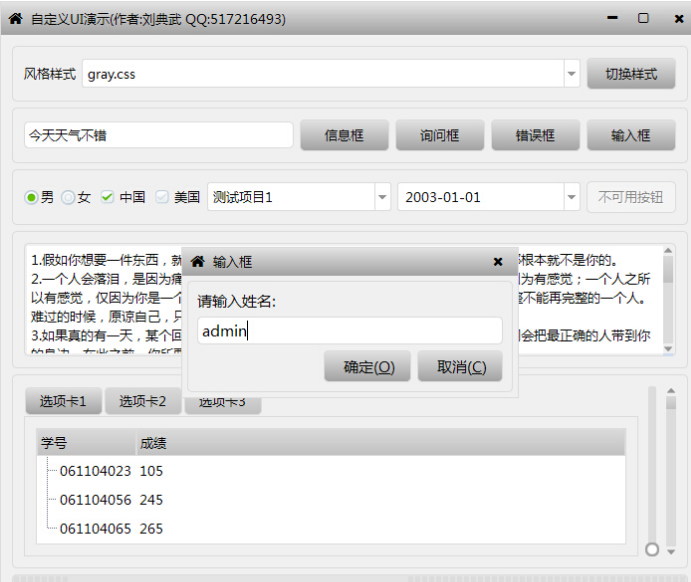
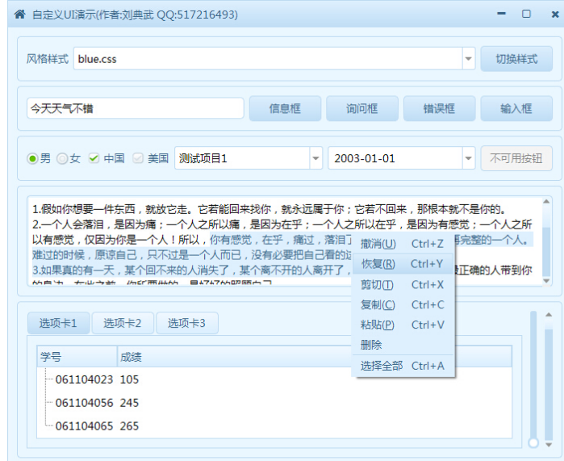
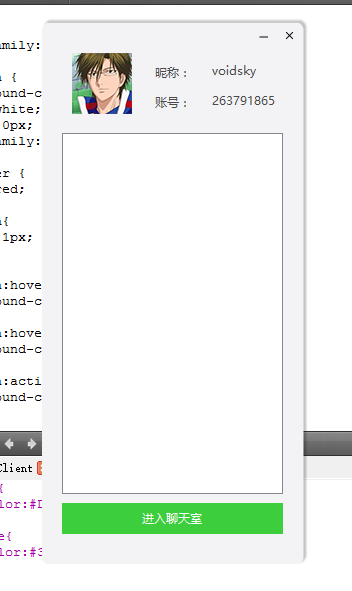
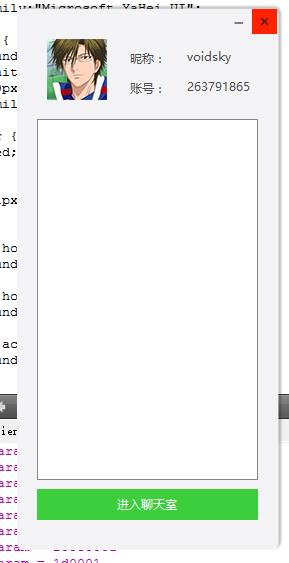
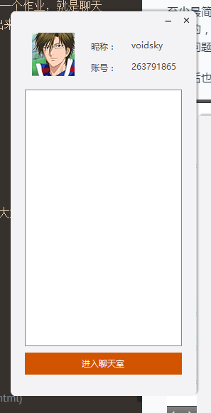
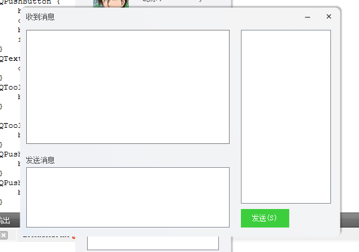
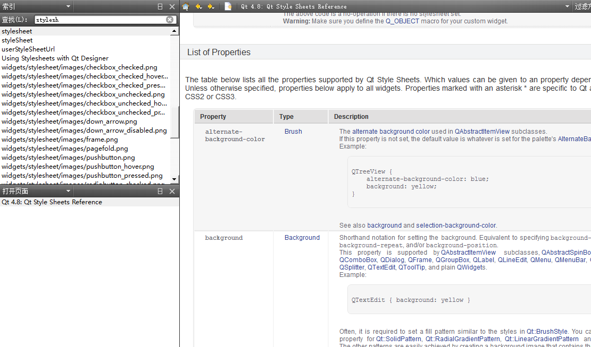
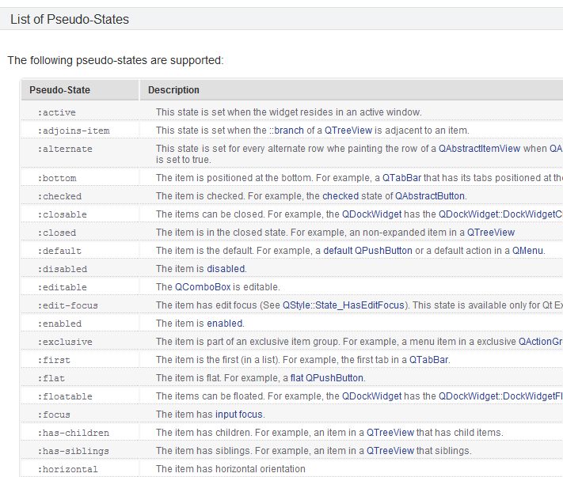

讲讲关于Qt的大杀器——qss
---
>自学qt一年多了，也捣鼓做了不少东西了，发现qt比mfc强大的地方就在与它的简洁和强大的qss。

>如果学qt不知道qss那基本就和美观的界面无缘了。简单来说，qss就源于网页的css（语法也基本一样一样的）所以如果你之前懂一些css的知识，学qss那是非常快的。

css学习：http://www.w3school.com.cn/css/css_syntax.asp

#qss能做什么？
###1.可以换肤：
http://www.qtcn.org/bbs/read-htm-tid-58060.html



###2. 可以做统一炫酷的界面


#qss用法


和css一样，qss的语法也是：

	selector {property: value}

不同的属性间用;分隔，同一个属性可以设置多个值，用空格分隔

	selector {property1: value1 value2; property2: value3}	
	

##selector
selector有3种写法和css一致：
- **控件类（QButton, QLabel)：**直接控制所有的这类控间
- **控件名（#sendbtn)：**控制特定的控间
- **控间的特定状态（QButton:hover)：**当鼠标移动到button上时触发
- **子控件（QComboBox::drop-down）：**当一个控件里面含有子控间的时候，可以用这个方法。


##用法

###1. 对于特定控件，直接使用setStyleSheet（不需要加选择器了。
```
	this->ui->label_2->setStyleSheet("{color:red}");
```
###2. 可以对对话框，widget或者window使用setStyleSheet设置里面所有控件的属性
```
myDialog->setStyleSheet("QLineEdit { background-color: yellow }");
```
建议写成这种格式：
```
this->setStyleSheet("#photo{"
                    "border:1px;"
                    "}"
                    "QLabel{"
                    "color:#4a4a4a;"
                    "}"
                  );
```   

###3. 可以把qss写到文件里，然后读取出来(推荐)
```
	QFile qssfile(":/style/base.qss");
    qssfile.open(QFile::ReadOnly);
    QString qss;
    qss = qssfile.readAll();
    this->setStyleSheet(qss);
```

文件里内容
```
QLabel {
    color:#4a4a4a;
}

QPushButton {
    background-color:#3dce3d;
    color:white;
    border:0px;
}
```

#常用qss属性
qss的属性特别多，但是说实话，我觉得常用的qss就几个属性：
|语法|功能|
|-:-|-:-|
|background-color|设置元素的背景颜色。
|background-image|设置元素的背景图像
|color|设置字体颜色
|border|设置边框属性
|font-family|规定文本的字体系列|
|font-size|规定文本的字体尺寸|


通过这些属性你就已经能做出一些很好看的界面了，改个背景，把border设置为0，再加上hover，做一些流行的扁平化风格的界面，轻轻松松的，如果想做的更炫的，自己切一些图，设置成背景也就够了。


至少最简单做个这样的界面应该不难，下面的是我目前正在做的一个作业，就是聊天程序的，当然下面这个的边框圆角处理，阴影，可能是qss做不出来的，但是其他应该是没问题了。

我之后也会发一些教程上来。





#更多qss属性
我这里没列出来，因为qt自带的帮助文档已经很全面了，我觉得大家还是要学会自己利用手册，在索引——搜索stylesheet就行了




#参考：
[QSS知识总结](http://www.th7.cn/web/html-css/201405/37286.shtml)


