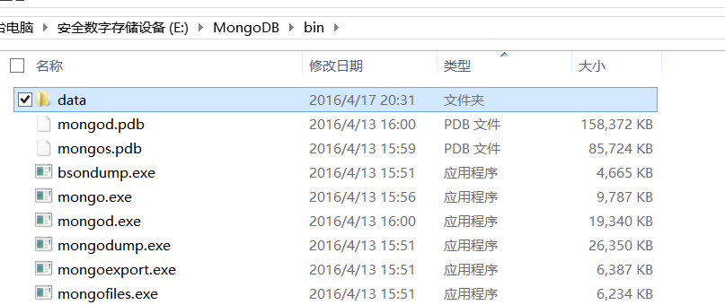
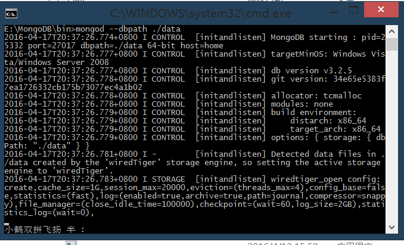
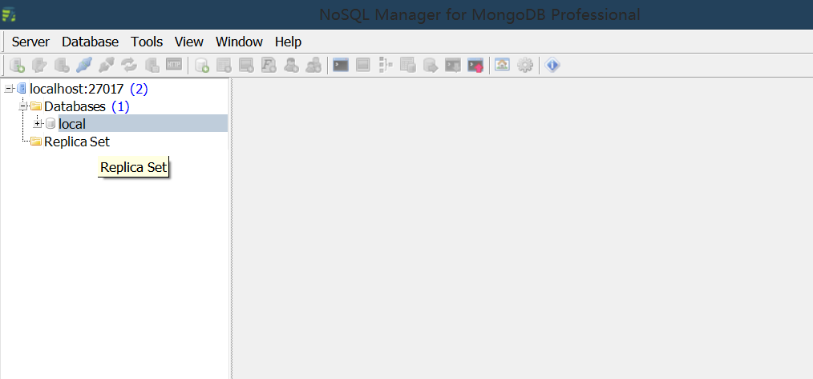
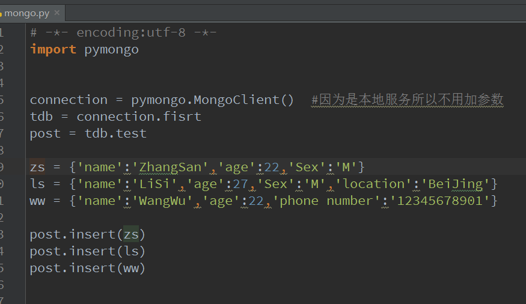
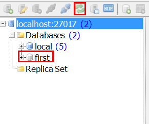
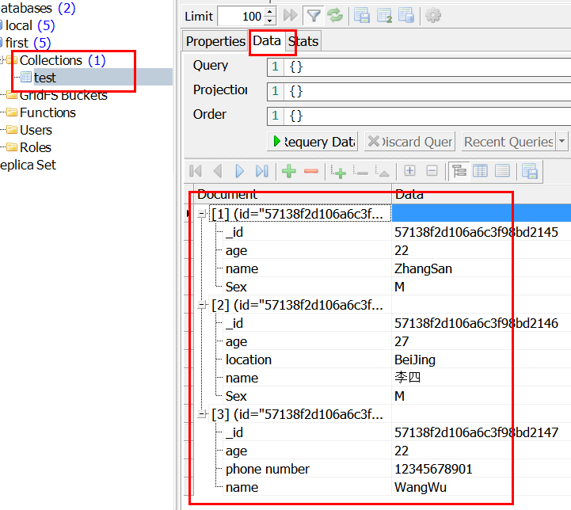

MongoDB与scrapy
---
MongoDB下载：
https://www.mongodb.org/downloads/

#MongoDB启动
创建一个目录用来存放数据


创建一个bat文件输入：
```
mongod --dbpath ./data
```


双击文件运行，好了目前MongoDB就已经启动了，下面这个对话框就不要关掉了，关掉服务就没了



#Mongo可视化
mongovue
http://www.mongovue.com/downloads/





#Python使用MongoDB
首先需要下载安装pymongo，安装方式不用我再说了把？

	pip install pymongodb


编写一个简单的程序，来运行看看

```python 
# -*- encoding:utf-8 -*-
import pymongo


connection = pymongo.MongoClient()  #因为是本地服务所以不用加参数
tdb = connection.first
post = tdb.test

zs = {'name':'ZhangSan','age':22,'Sex':'M'}
ls = {'name':u'李四','age':'27','Sex':'M','location':'BeiJing'}
ww = {'name':'WangWu','age':22.0,'phone number':'12345678901'}

post.insert(zs)
post.insert(ls)
post.insert(ww)

#post.remove({'mame':'LiSi'})

print '操作完成'
```

运行，可以发现已经有了一个first数据库，说明mongoDB可以在没有找到对应数据库的情况下新建一个数据库，这个操作就和文件写操作类似。






可以发现MongoDB中数据是以类似字典的形式存的，每条记录是独立的，所以同一关键词，不同的变量类型是没问题的。
