一步一步教你自定义博客园（cnblog）界面
---
#写在开头
>我之前在博客园没怎么发东西，就是觉得博客园的Markdown不支持实时预览，加上markdown显示出来的效果，主页皮肤效果总是觉得很奇怪不能让我满意。

>但是我今天偶然发现，原来博客园是允许自定义样式的，我觉得我之前傻了。这点特别好，可以避免自己的博客和别人的雷同，可以个性化自己的主页，文章显示效果也可以自己控制，好似一下又回到了`做qq空间的年代`

虽然博客园现在支持的模板已经很多了，但是我们还是加入一些自己的元素让自己的主页更加生动符合自己的风格。

设置自定义css的地方在：`设置`的`页面定制CSS代码`
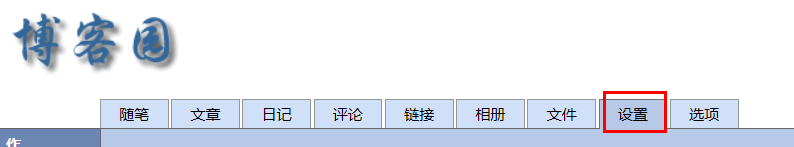

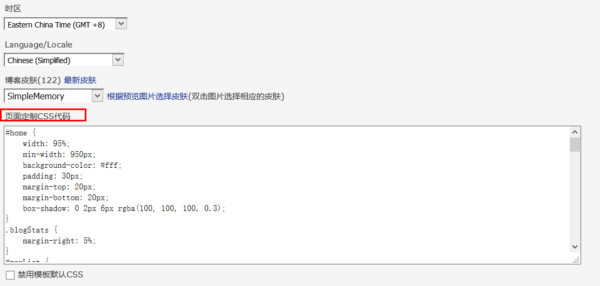

对于基础的好的人，当然可以完全自己做一个皮肤出来，可以完全禁用默认的CSS，对于我们实用注意者来说，还是“借鉴”比较好。

#学CSS
你要学会定制，怎么的也要会一些基础的CSS吧？咱不说精通，起码什么background，font，border，margin之类的应该知道怎么用，其他的可以边看边查。

一般来说都是去w3school把~一定要掌握个大概再继续哦~~

http://www.w3school.com.cn/css/index.asp

#选择一个模板
我们在皮肤里先挑一个现成的模板开始我们的定制之旅，这里我选了SimpleMemory，我还是喜欢这种朴素的风格。
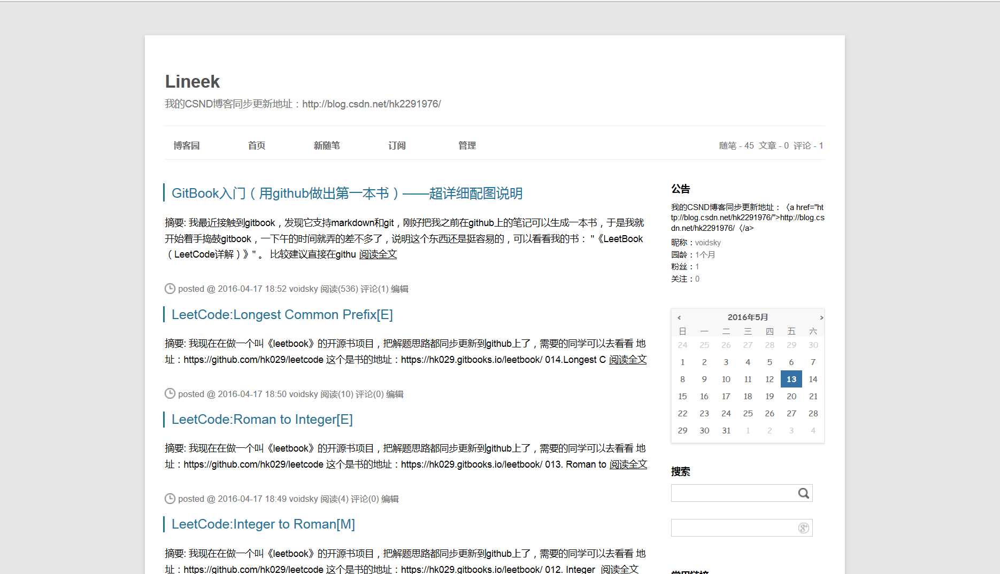

这个模板本身就挺好看，不用定制也可以，但是我觉得它默认有点过于“精致”，页面只显示65%，分明没充分利用空间嘛。

#查看元素
我们开始定制的第一步就是学会查看元素，基本Chrome和Firefox都可以用F12来方便查看页面元素。

一般来说当前CSS样式可以直接显示在右边，并且是可以编辑的！
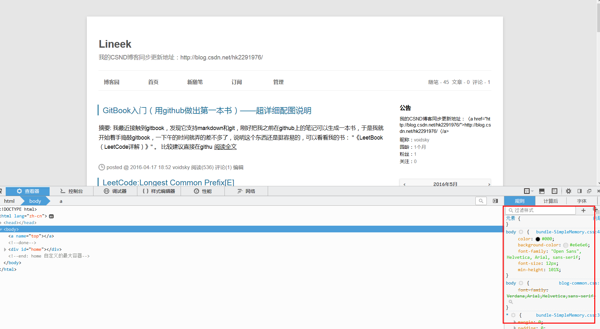

然后点这个按钮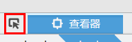

这个按钮就是可以用鼠标选择页面中的元素，然后下面会显示对应的元素。
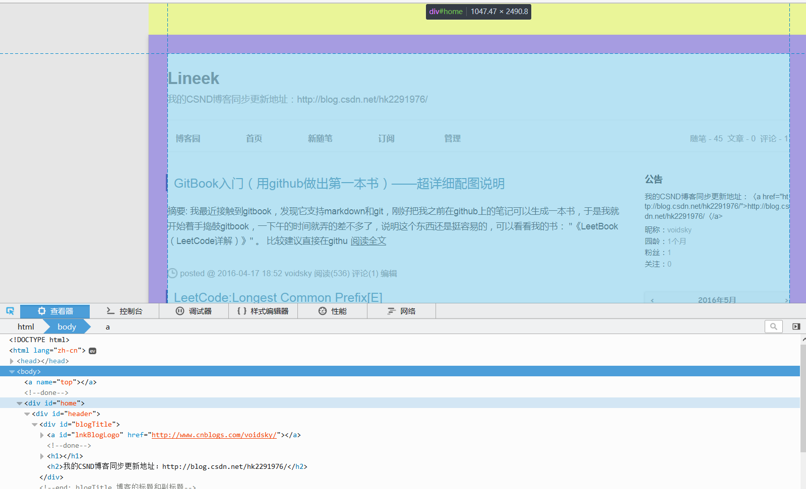

好了，我们看到这里是`
`,它的样式表也显示在右边了，我们可以看到果然，这里的width只有65%。
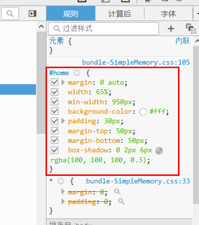

这里我觉得90%挺好的，可以看到，页面直接根据我的修改变化了！
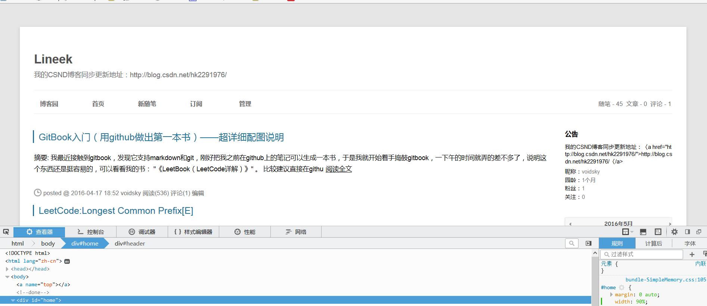

然后我觉得顶部也可以小一点，我把`margin-top`改成 20px;

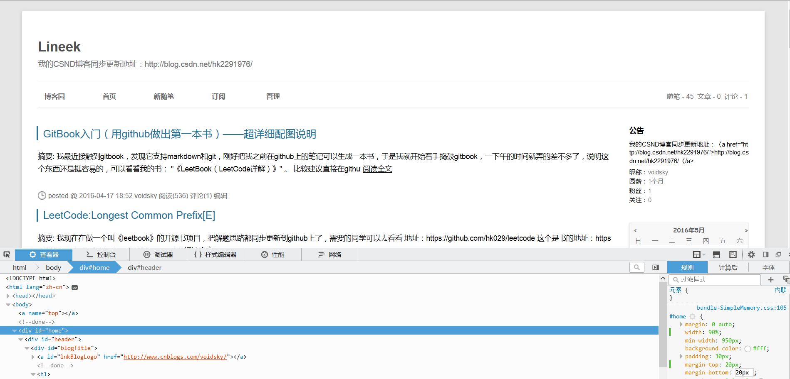

好了这个整体我觉得不错了，我想保存这个怎么办呢？很容易，直接复制这个元素的CSS就行了。

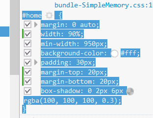

然后粘贴到前面说的`页面定制CSS代码`的地方，其实你可以只用复制你修改的部分，其他的不用复制，但是为了方便，就这样全复制过来也行。

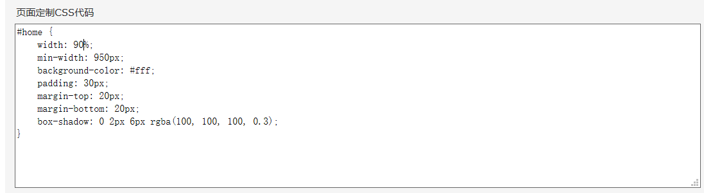

然后保存，再回到自己的主页看看，是不是变了?

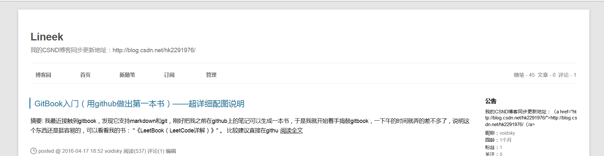

`这里我强烈建议大家开2个界面，一个是设置界面，一个是主页界面，修改了一个元素就在设置界面里增加，防止忘记保存！！`

#更进一步
##标题
我想让标题更大点
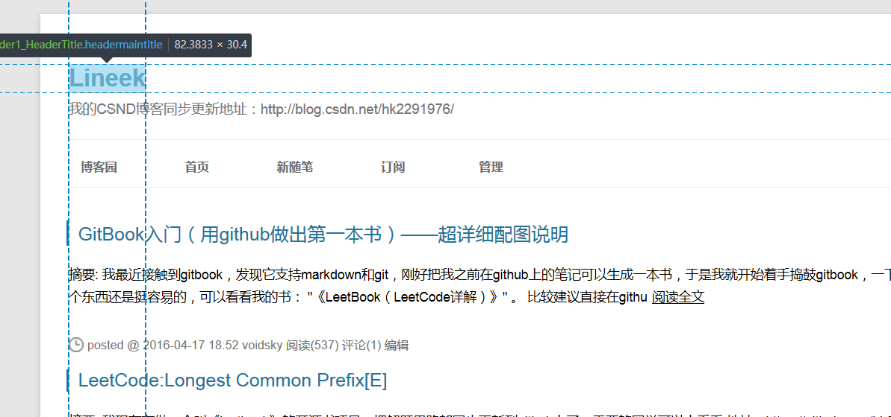

我觉得50px不错
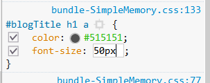

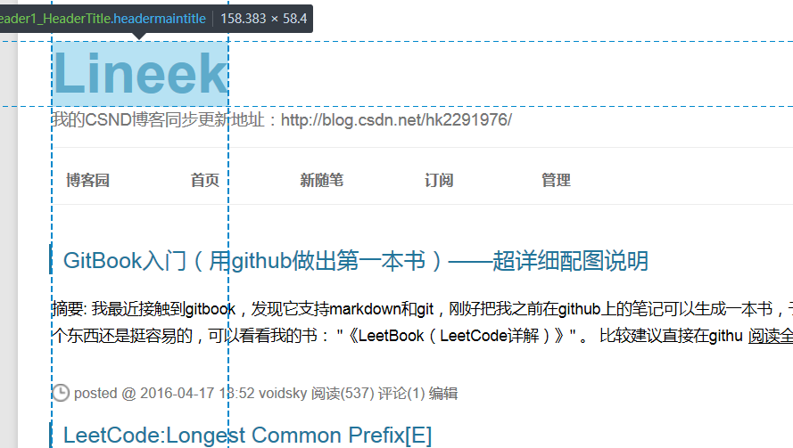

##导航栏
导航栏也要大点，而且字有点偏下了，移动上来点，然后最好移动的时候变蓝色
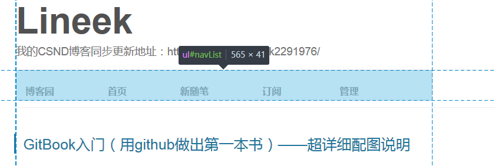

字体变大

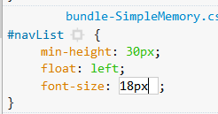

移动变色
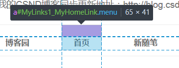

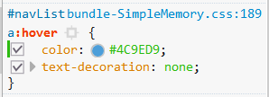

移动上点

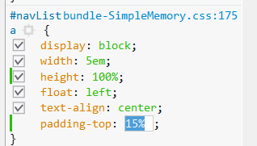

好了，这里我们保存一下
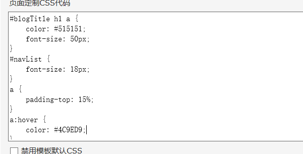

奇怪，导航栏颜色怎么没变化？？？

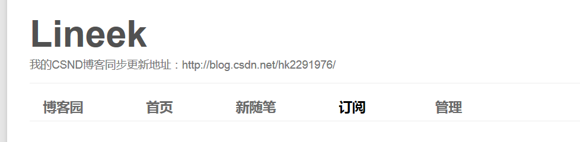

注意：这里不能直接复制a，如果你有点CSS基础了应该知道，这里的a是特指#navList下面的a，所以这里我们要在a前面加上#navList

我们再保存看看

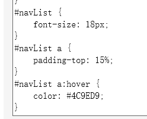

是不是好已经修改了？

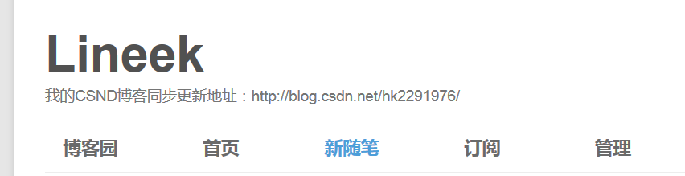

##侧边栏
侧边栏的标题我觉得不好看 找到这个元素

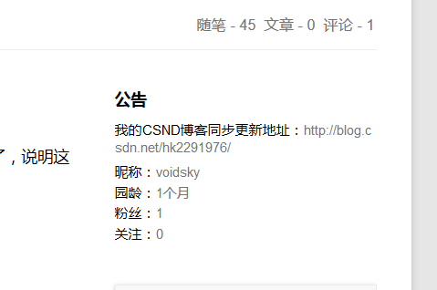

知道是用的`.catListTitle `类，我就对它进行大改

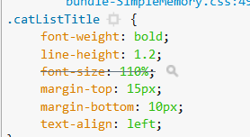

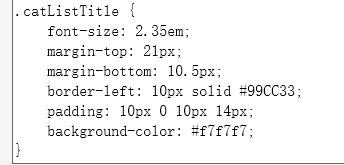

改完效果

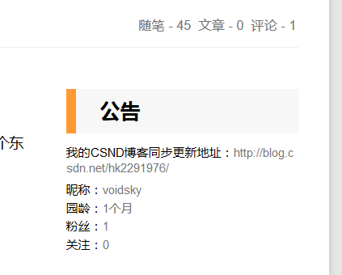

##修改内容显示和边栏显示
我想把这内容和边栏显示换一下，
通过查看元素我们知道这两部分分别为`mainContent`和`sideBar`
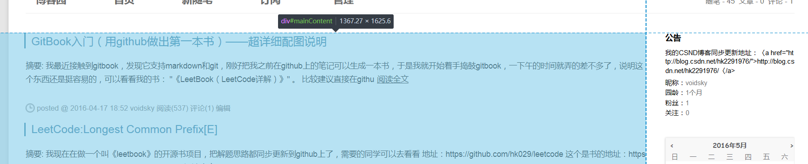

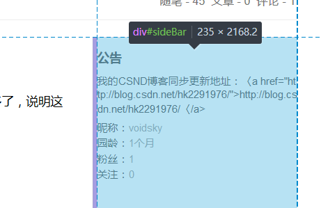

我把`mainContent`的`float`改成right
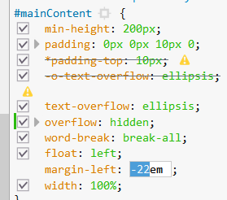

好了，看差不多了，这里感觉和边栏有点近

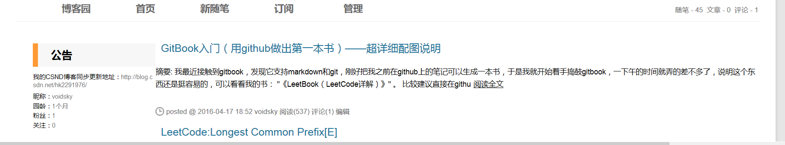

我们把sidebar的float改成left

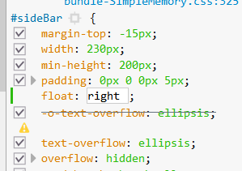

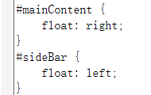

好了大功告成！

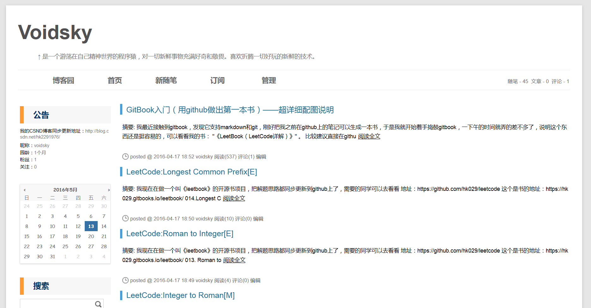

剩下的，还有很多可以个性化的地方，由大家自己去发挥吧!!

对了，文章里面的标题，`h1`，`h2`，`p`,`img`什么的也可以改哦~~大家自由发挥吧！只要在前面加上`#cnblogs_post_body`就行了（你们自己应该也能找到）

