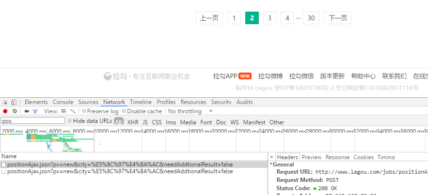
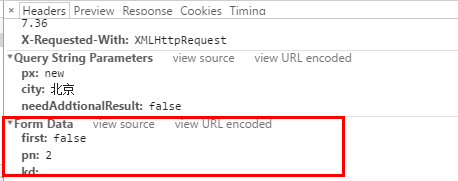
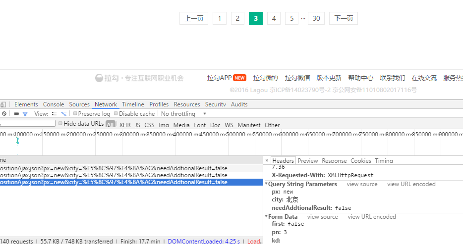
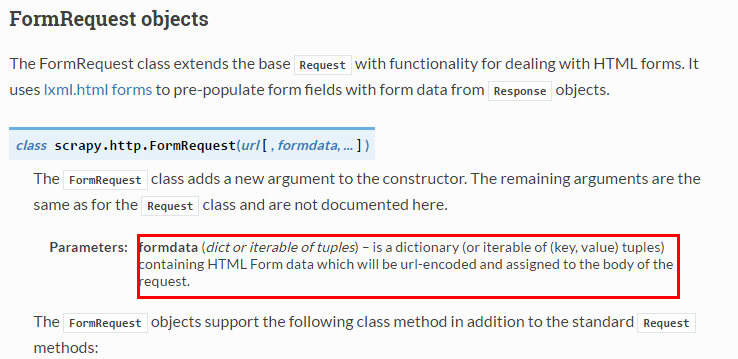
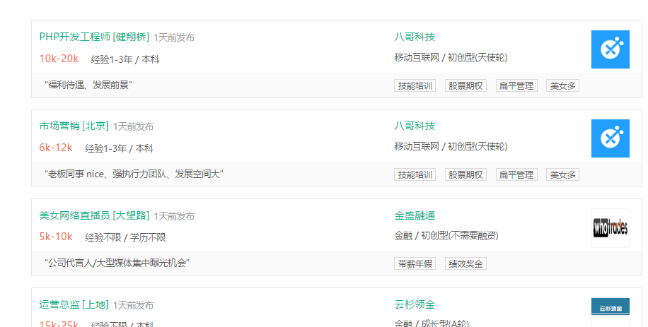
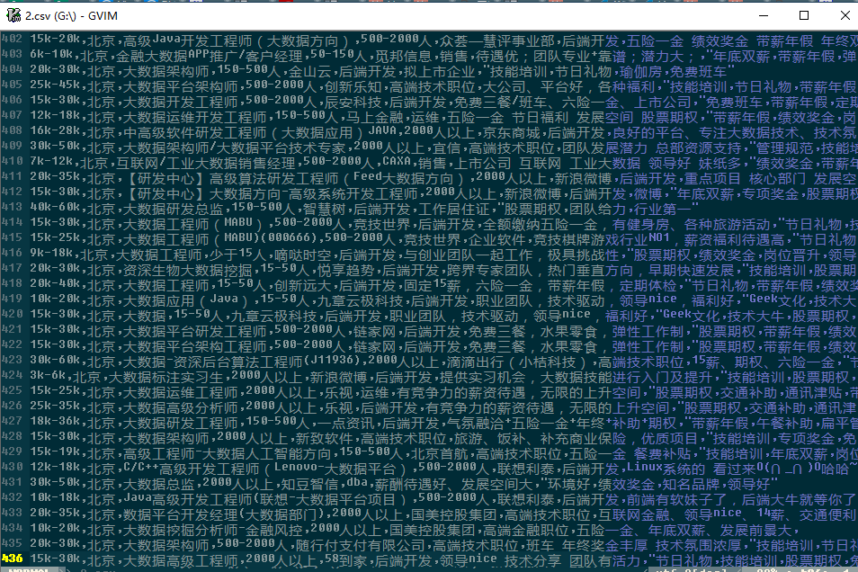

【图文详解】scrapy爬虫与动态页面——爬取拉勾网职位信息（2）
---

>上次挖了一个坑，今天终于填上了，还记得之前我们做的拉勾爬虫吗？那时我们实现了一页的爬取，今天让我们再接再厉，实现多页爬取，顺便实现职位和公司的关键词搜索功能。

之前的内容就不再介绍了，不熟悉的建议先去看之前的文章吧。[【图文详解】scrapy爬虫与动态页面——爬取拉勾网职位信息（1）](http://blog.csdn.net/hk2291976/article/details/51284576)

#开始
还是回到我们熟悉的页面，这里，我们熟练的打开了Newwork标签，我们点下一页，看会出来什么结果


果然还是跳出来一个页面，但是貌似。。网址一样，我打开看一下


和之前不一样也！


一样的网址，结果不一样的结果，这怎么可能！！小伙伴是不是也和我一样，一脸懵B!


别急，我们继续看看别的信息
在preview我们看到了Pageno.2 说明确实不是同样的内容


#Header
我们继续看header，貌似发现了不起的东西。



这个pn不就是pageno的简写吗？（什么，你怎么不知道有这个缩写？）我们可以再打开一个网页看看，事实证明，我是对的。



好的，我们现在知道页码信息在这里了，那要怎么把这个信息附加上呢？？

#Get or Post??
我们知道网页有两种方式传输数据，get和post，get是把需要传输的数据写到URL上，用户可以直观看见，就是我们之前一直使用的（比如搜索城市，工作经验，学历什么的）。post是通过HTTP post机制，将表单内各个字段与其内容放置在HTML HEADER内一起传送到ACTION属性所指的URL地址。用户看不到这个过程。

#scrapy实现post
看来我们得想办法用scrapy实现post了。
如果你还记得我们之前讲request的时候讲了request是可以轻松实现post的，那scrapy有request吗？毫无疑问是有的。我们在文档中找到了一个叫`FormRequest`的对象，它能实现post功能，并给出了例子



我们在我们的之前代码中的class中加入一个`start_requests`函数

```
def start_requests(self):
        return [scrapy.http.FormRequest('http://www.lagou.com/jobs/positionAjax.json?px=new&city=%E5%8C%97%E4%BA%AC',
                                        formdata={'pn':'2'},callback=self.parse)]

```


运行一下，出错了，才发现，原来目前拉勾的json结构改了，中间加了一个`positionResult`


修改代码：
```
        jcontent = jdict["content"]
        jposresult = jcontent["positionResult"]
        jresult = jposresult["result"]
```

再运行一下，和第2页的一致，说明成功了





这里再说下，如果你在关键词里搜索，你会发现链接也不会变化，说明什么？？说明也是用的post，比如我搜索大数据，可以看到`kd`变成了大数据，所以我们也可以构造特定关键词的爬虫了。


#实现自动翻页

我们只要能控制pn就行了，我们新增一个变量`curpage`让它运行一次自加1，然后我们还是用之前的yield的方法
```
if self.curpage <= self.totalPageCount:
	self.curpage += 1
yield scrapy.http.FormRequest('http://www.lagou.com/jobs/positionAjax.json?px=new&city=%E5%8C%97%E4%BA%AC',                                        formdata={'pn':str(self.curpage)},callback=self.parse)
```

要说明的是，之前json文件里是有个`totalPageCount`属性的，目前没了！所以不能直接从json文件中获取页数信息了，怎么办呢？如果你要细心观察就可以发现有个`totalCount`属性，你做实验可以发现，每页都是15个，页数就是totalCount/15取整，如果页数大于30，只显示30页。


```
  self.totalPageCount = jposresult['totalCount'] /15;
        if  self.totalPageCount > 30:
            self.totalPageCount = 30;
```

这里我们爬所有北京有关“大数据”的工作
```
 formdata={'pn':str(self.curpage),'kd':'大数据'}
```

好了大工告成！享受你的成果吧！！




这个工程我上传到了github，有兴趣的同学可以下载下来看看：[https://github.com/hk029/LagouSpider](https://github.com/hk029/LagouSpider)

