动态加载网页爬取
---
##5-14更新
注意：目前拉勾网换了json结构，之前是`content` - `result` 现在改成了`content`- `positionResult` - `result`,所以大家写代码的时候要特别注意加上一层`positionResult`的解析。

>现在很多网站都是动态异步加载的，就是说，网页打开了，先给你看上面一部分东西，然后剩下的东西再慢慢加载。
所以你可以看到很多网页，都是慢慢的刷出来的，或者有些网站随着你的移动，很多信息才慢慢加载出来。这样的网页有个好处，就是网页加载速度特别快（因为不用一次加载全部内容）。


但是这对我们写爬虫就不方便了，因为你总是爬不到你想要的东西！

我们举个例子，我因为最近想分析拉勾网有关职位情况的数据，所以我上了他们网站：
http://www.lagou.com/zhaopin/

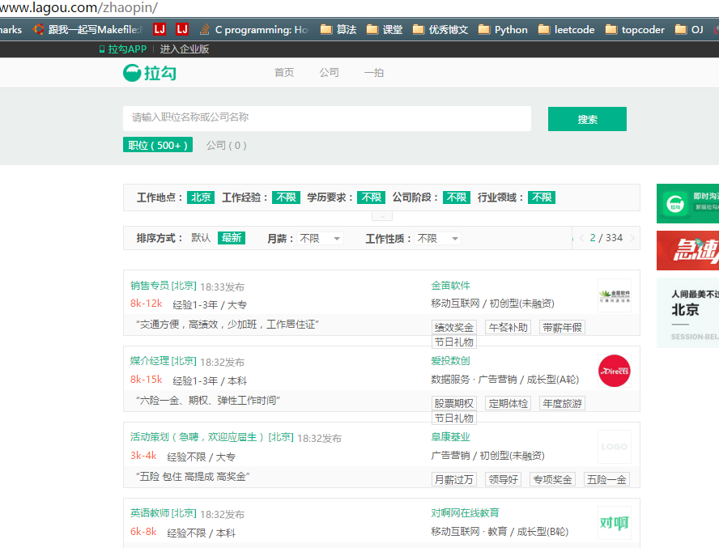


可以看到，这里有很多职位信息。注意，这里当我们点下一页


我们可以发现，网页地址没有更新就直接加载出来了！！
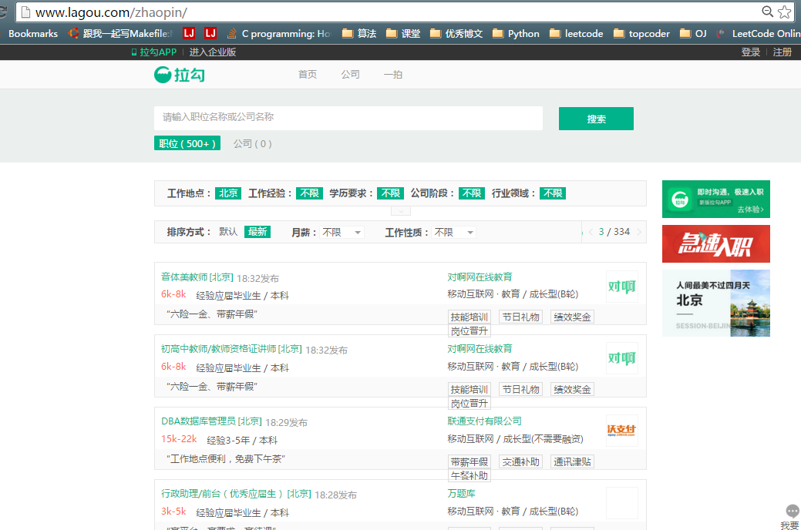

这明显就是一个动态页面，我们写个爬虫来爬一下网页，看看能得到什么内容，现在应该能很快写出（搭出）一个这样的爬虫吧？（其实啥也没有）

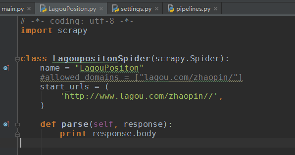

可以看到输出，你可以把所有源代码浏览一遍，里面没有任何有关职位的信息！
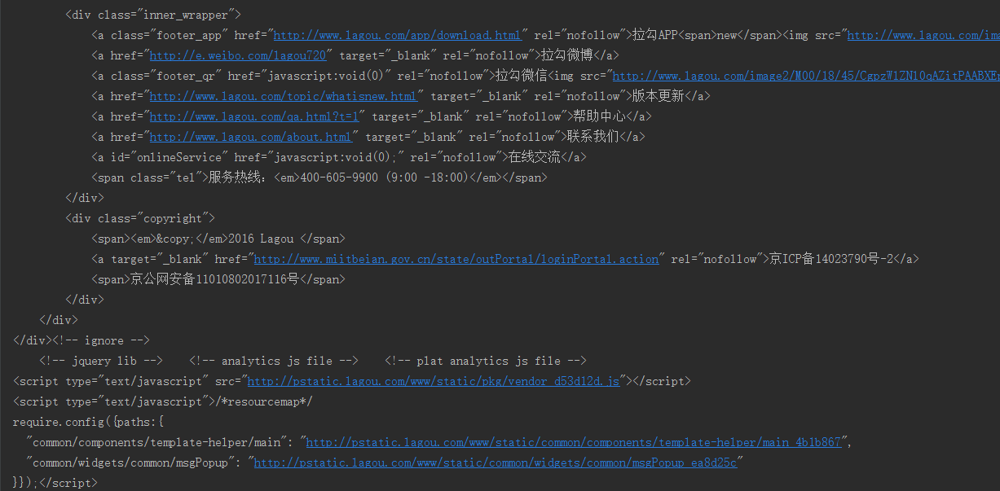

如果你觉得不直观，我教你一招，我们简单的把它输出到一个html看看


就是这么个情况。。关键部分呢！空的！！！
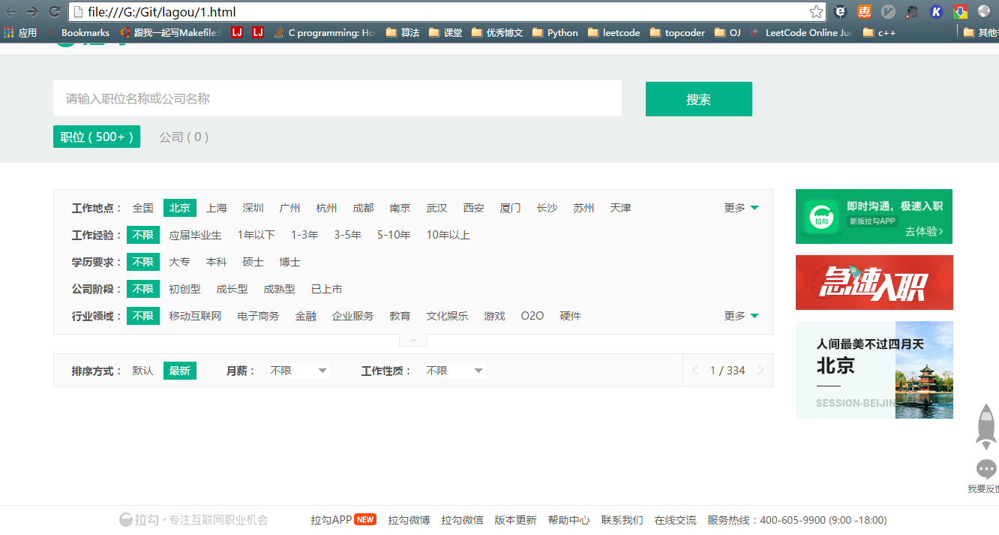

#寻找可以网页
这时候要怎么办呢？难道信息就爬不了吗？？

当然不是，你要想，它只要是显示到网页上了，就肯定在某个地方，只是我们没找到而已。

只不过，这个时候，我们就要费点功夫了。我们还是回到刚才的网页上去点F12，这时候，我们用network功能


这时候你可能看到里面没东西，这是因为它只记录打开后的网络资源的信息。
我们按F5刷新一下。


你可以看到开始唰唰的刷出东西来了……太快了，我眼睛有点跟不上了，我们等它停下来，我们随便点个资源，会出现右边的框，我们切换到response


然后我们就开始找可疑的网页资源。首先，图片，css什么之类的可以跳过，这里有个诀窍，就是一般来说，这类数据都会用json存，所以我们尝试在过滤器中输入json

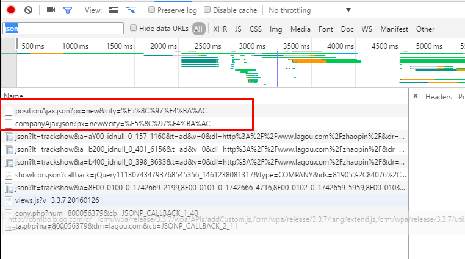

我们发现了2个资源感觉特别像，其中有个名字直接有position，我们点击右键，在新标签页打开看看
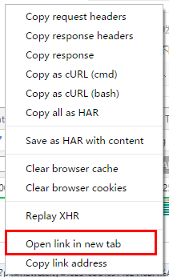

虽然看上去很乱（密集恐惧症估计忍不了）但是实际上很有条理，全是键值对应的，这就是json格式，特别适合网页数据交换。

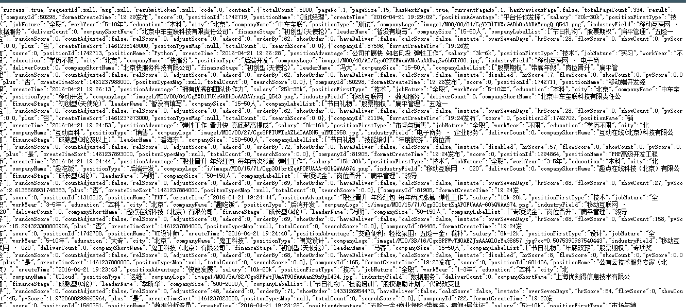

这里我们发现就是这个了！所有职位信息都在里面，我们赶紧记录下它的网址


#网页构造
通过观察网页地址可以发现推测出：
http://www.lagou.com/jobs/positionAjax.json?这一段是固定的，剩下的我们发现上面有个北京

我们把这里改成上海看看，可以看见又出来一个网页内容，刚好和之前网页把工作地改成上海，对应的内容一致


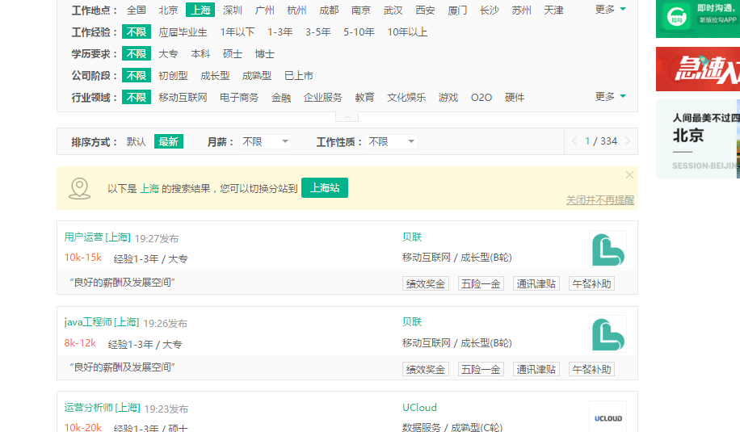

所以我们可以得出结论，这里city标签就代表着你选的工作地点，那我们要是把工作经验，学历要求，什么都选上呢？？可以直接看到，网址就变了很多


我们直接把这些复制到刚才我们找到的网页上


可以发现和网页内容一致

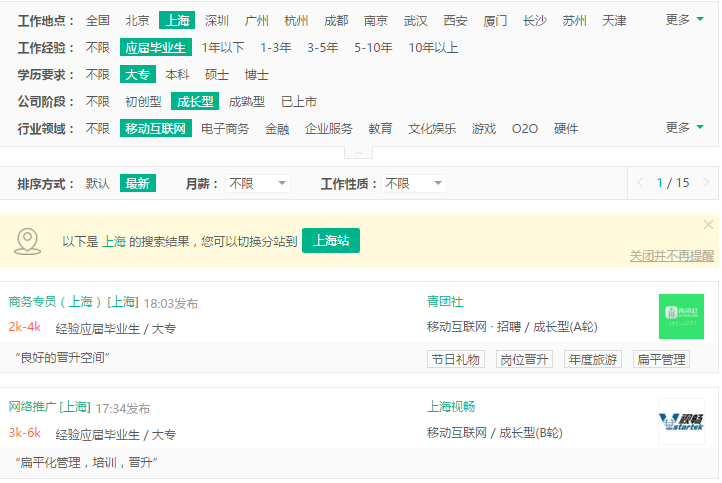


现在我们可以下结论，我们需要的就是这个网址：
http://www.lagou.com/jobs/positionAjax.json

然后后面可以加这些参数：

gj=应届毕业生&xl=大专&jd=成长型&hy=移动互联网&px=new&city=上海

通过修改这些参数，我们就可以获取不同的职位信息。

<font color=red>注意：</font>这里的构造还比较简单，有时候，有些网址的构造远比这个复杂，经常会出现一些你不知道什么意思的id=什么的，这个时候，可能这个id的可能值可能就在别的文件中，你可能还得找一遍，也可能就在网页源代码中的某个地方。
还有一种情况，可能会出现time=什么的，这就是时间戳，这时候，需要用time函数构造。总之，要具体情况具体分析。
```
import time
time.time()
```

#编写爬虫
因为这个网页的格式是用的json，那么我们可以用json格式很好的读出内容。
这里我们切换成到preview下，然后点content——result，可以发现出先一个列表，再点开就可以看到每个职位的内容。为什么要从这里看？有个好处就是知道这个json文件的层级结构，方便等下编码。
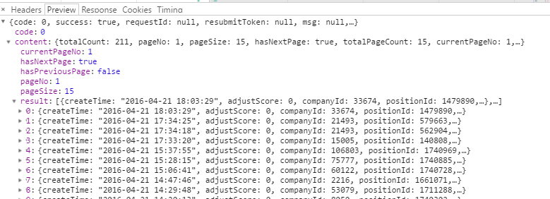

整个处理的代码就那么几句话，可以可出，这里完全和刚才的层级结构是一致的。先content然后result然后是每个职位的信息。
```
        jdict = json.loads(response.body)
        jcontent = jdict["content"]
        jresult = jcontent["result"]
        for each in jresult:
            print each['city']
            print each['companyName']
            print each['companySize']
            print each['positionName']
            print each['positionType']
            print each['salary']
            print ''
```
当然还是要引入json
```
	import json
```
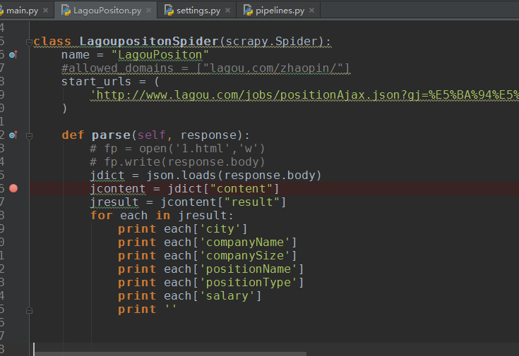


我们可以运行看看效果

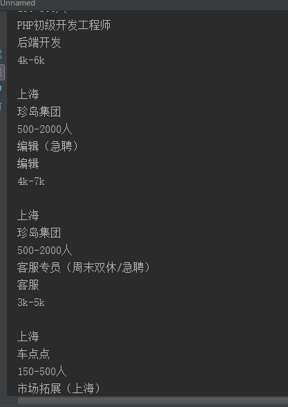

然后，我们可以把信息存到文件或者数据库了，那就是之前学过的内容了。

##修改items.py
加入你需要的内容
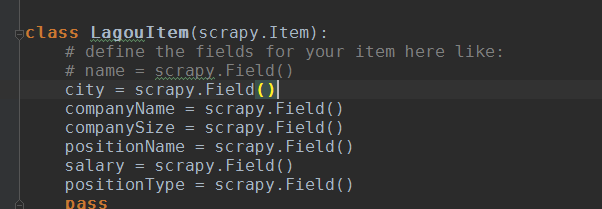


##修改settings.py
看你是需要存入数据库还是文件，之前都说过了

##修改pipelines.py
如果需要加入数据库，这里加上数据库操作，如果需要写入文件，可能不用修改这个文件

##修改parse()
把数据加入item，然后yield，大家应该很熟悉了
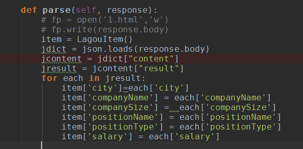

