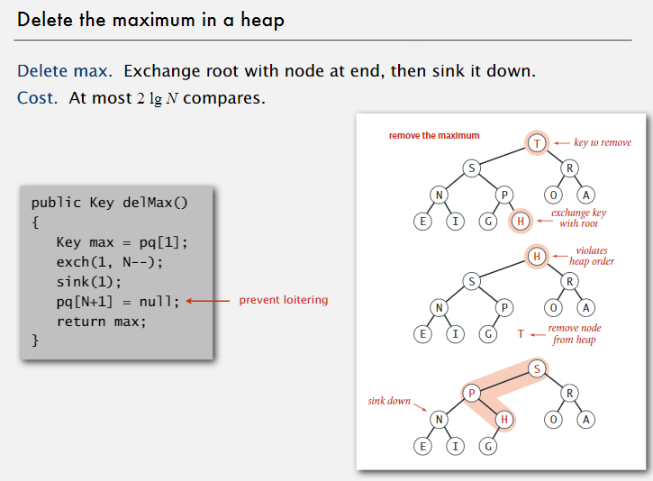

##优先队列（Priority Queue)

@(算法Algorithms)

---
###1.优先队列的API和初等实现
做一个总结：
>栈 ：先进后出
队列 ：先进先出
随机队列 ： 随机出
**优先队列：**每次出来的是最大值或最小值
####1.1优先队列的API


优先队列在很多场合都有用，
比如：在大量数据里，如果取前M大的数据(存储不足以存下如此大规模数据)，就可以用优先队列（MinPQ来做，类似MaxPQ，只是每次删除最小值)——一直保证队列中只有M个比较大的数据，每次删除超过M个里面的最小值。


####1.2初等实现
如果用数组来做，我们可以考虑用排序好的数组或没排序的数组。

它们的实现方案都比较简单，但是都有致命的缺点：
>排序数组，每次插入的时候需要N的时间复杂度
未排序的数组：每次删除或查找的时候，需要N的时间复杂度
我们的目标是找到一个插入和删除都logN复杂度的数据结构。——二叉堆


###2.二叉堆
####2.1二叉堆的定义
堆是一个完全二叉树结构（除了最底下一层，其他层全是完全平衡的），如果每个结点都大于它的两个孩子，那么这个堆是有序的。
> 二叉堆是一组能够用堆有序的完全二叉树排序的元素，并在数组中按照层级存储（不用数组的第一个位置）

####2.2二叉堆的性质	
- 最大的元素在a[1] (root结点)
- 每个k的父亲在k/2
- 每个k的孩子在k*2和k*2+1

####2.3二叉堆的操作
#####2.3.1 上浮（孩子大于父亲）——对应插入操作
循环，每次比较自己和父亲，如果比父亲大就交换，直到root。


#####2.3.2 插入
先把元素加入数组的最后一个位置，然后进行上浮到正确位置


#####2.3.3 下沉（父亲小于儿子）——对应删除操作
循环，每次比较自己和两个孩子，如果比孩子小就交换，如果比两个孩子都小，就交换到两个里面较大的一个。直到叶子。


#####2.3.4 删除最大元素
<font color="red">先把根元素与最后一个元素交换</font>，删除最后一个元素，然后从根开始下沉到正确位置。

####2.4  二叉堆优先队列代码
```java
/**
 *
 * @author rocky
 */
public class MaxPQ<Key extends Comparable<Key>> {

    private Key[] pq;
    private int N;

    public MaxPQ(int capacity) {
        pq = (Key[]) new Comparable[capacity + 1];
    }

    public boolean isEmpty() {
        return N == 0;
    }

    public void insert(Key key)
    {      
        N++; 
        pq[N] = key;
        swim(N);
    }

    public Key delMax() {
        Key max = pq[1];  //get the max element
        exch(1, N);     //exchange between the root and the last element
        N--;   
        sink(1);   //sink to the right place
        pq[N+1] = null;   //delete
        return max;
    }

    private void swim(int k)
    {
        while(k > 1 && less(k/2, k))
        {
            exch(k, k/2);
            k /= 2;
        }
        
    }

    private void sink(int k) {
        while(k*2 <= N)    //if this node has left child 
        {
            int child = k * 2;   
            if (child < N && less(child, child + 1)) {  //if the left child is less than the right child
                child = child + 1;   //change child to the right child
            }
            if (less(k, child)) {
                exch(k, child);
            }
            k = child;
        }
    }

    private boolean less(int i, int j) {
        return pq[i].compareTo(pq[j]) < 0;
    }

    private void exch(int i, int j) {
        Key t = pq[i];
        pq[i] = pq[j];
        pq[j] = t;
    }
}

```

###2.5 二叉堆扩展


####2.5.1 不可变性
我们算法的前提是用户不会改变队列的元素，如果用户能改变队列的元素，那么队列成立的条件就会破坏，
不可变的数据类型，就是说一个实例一旦建立，就不可以改变。java里很多类型都是不可变的。


这有很多好处，但是坏处就是如果你需要改变值必须要新建一个对象。


### 3.堆排序
####3.1堆排序思想
堆排序的思想很简单，就是利用了堆的优点，不断的找最大值，然后删除最大值，重复操作。
- 首先，要构造一个二叉堆出来，我们采用自底向上的思想。


- 做删除root的操作（但是不是真删除，只是把root元素放到最后了）


- 循环直到数组有序。

我们可以发现加入的代码非常少！！

####3.2堆排序代码
```java
public class Heap
{
   public static void sort(Comparable[] a)
   {
      int N = a.length;
      for (int k = N/2; k >= 1; k--)
         sink(a, k, N);
      while (N > 1)
      {
         exch(a, 1, N);
         sink(a, 1, --N);
      }
   }
   private static void sink(Comparable[] a, int k, int N)
   {  
/* as before */
  }
   private static boolean less(Comparable[] a, int i, int j)
   {  
/* as before */
  }
   private static void exch(Comparable[] a, int i, int j)
   {  
/* as before */
  }
}
```
<font color=red>注意:</font> 我们之前操作堆都是从1开始的，但是排序的时候，需要排序的元素是从0开始的，我们需要在交换的时候，做一些变化（减1）。

#### 3.3堆排序的性能
> 堆排序是我们目前接触的<font color=red>第一个</font>in-place的并且时间复杂度为NlogN的算法（快排最坏情况下会有$N^2$的复杂度）


但是它有一些缺点，导致实际用的不多：
- 内部循环代码过多（多次比较）
- 很少能用到cache，因为它的比较是跳跃的，用不到附近的元素。（快排是跟附近的元素比较）
- 不稳定


