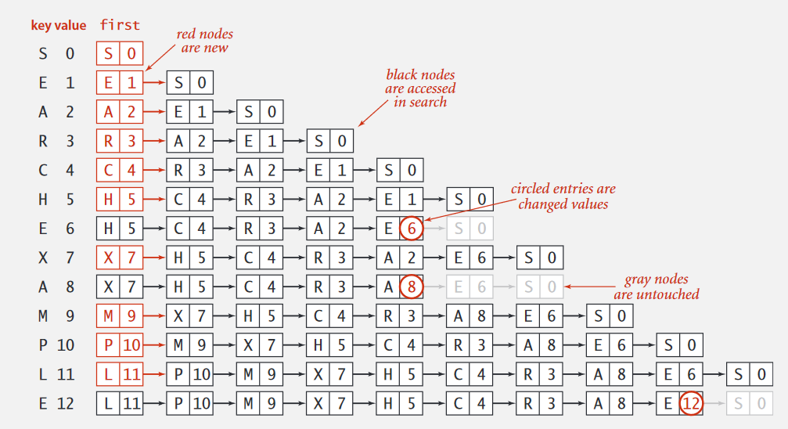
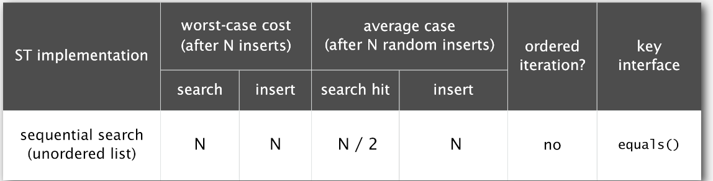
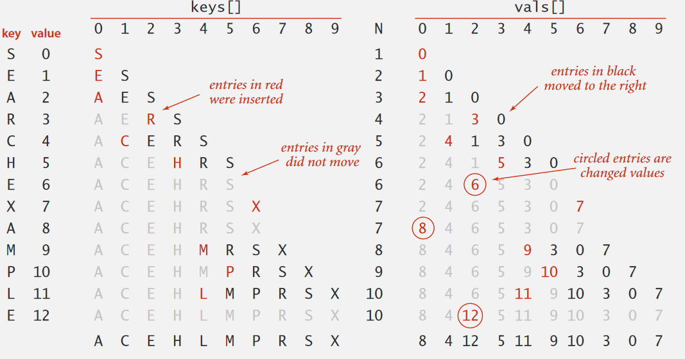
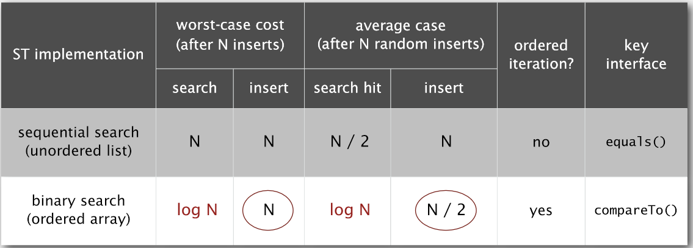
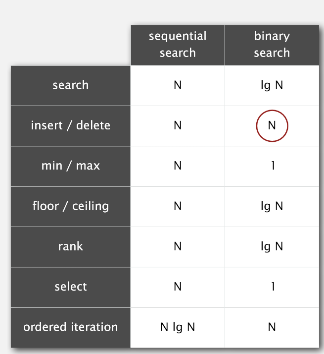

符号表（Symbol Table) (2)
---
初等实现和有序符号表

这里主要介绍一下符号表可能的初等实现，并分析他们的不足，然后引出有序符号表的概念，为下篇二叉查找树做铺垫。

#无序链表
这应该是最简单的实现方案了，我们只用一个无序链表就可以实现符号表了

我们可以分析出这个算法的性能：

可以看出，性能很差。

#有序数组
我们还可以用两个有序数组来实现ST（一个Key数组，一个Value数组，相互对应），如果数组有序，那么我们可以考虑用二分查找提高查找效率。这样查找复杂度可以提高到logN

但是有序数组带来一个问题，插入比较麻烦，插入的时候需要移动交换多次到正确的地方。

我们可以看出，用有序数组的话，插入效率并没提升很多，但是查找效率可以提高到logN。

#有序符号表
>上面提到了可以用有序数组实现符号表提高查找效率，以后会有算法能提高插入效率。这里我们先引入一个新的概念：有序符号表。

其实也很好理解，就是符号表有序。那有序的符号表有什么特殊的呢？最大的不一样就是实现了一些有序操作。

除了之前说的那些API外，还实现了很多有序操作：

|函数|功能|
|-:-|-:-|
|Key floor(Key key)|小于key的最大键
|Key ceiling(Key key)|大于key的最小键
|int rank(Key key)|key的排名（小于key的个数）
|Key select(int k)|返回rank为k的键
|Key min()|返回最小的键
|Key max()|返回最大的键
|void deleteMin()|删除最小值
|void deleteMax()|删除最大值

我们看看如果使用上面两种初等实现有序符号表的功能，性能怎么样。可以看出二分查找效率还是高很多，现在我们想想如何提高插入和删除效率？这就是下面我们要提出的二叉查找树。

